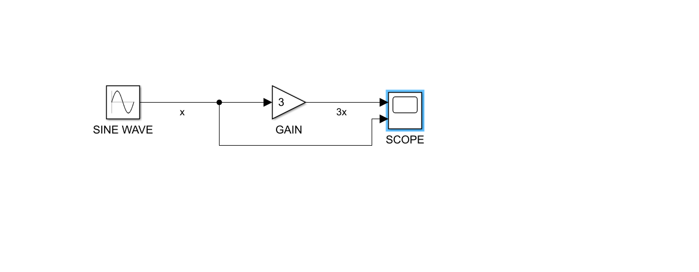
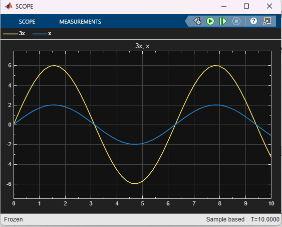

# 🎛️ Simple Sine Wave Amplifier in Simulink

This project is a basic simulation using Simulink where a sine wave is amplified using a Gain block and visualized using a Scope.

## 🎯 Objective  
To practice modeling a simple signal-processing system and understand Simulink's visual simulation workflow.

---

## ⚙️ Components Used  
- Sine Wave Generator  
- Gain Block (set to 3)  
- Scope (for output visualization)

---

### 📈 Scope Output

The graph below shows the original sine wave (x) and the amplified output (3x):

## 📁 File  
- `Simple_Simulink_Model.slx`

---

## 📝 Notes  
This model was created as part of my learning journey with Simulink. It represents my first project and serves as a foundation for building more complex models involving physical systems and control logic.
